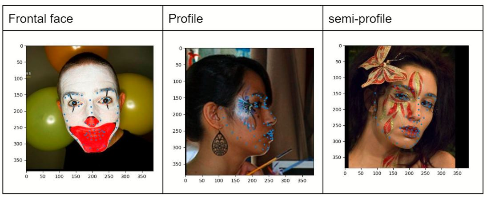

# Computer Vision EEE 5053 (Spring 2022)
Final Project: Light-Weight Facial Landmark Detection Challenge  
*Hosted by Microsoft AI R&D Center, Taiwan (Face Science Team)*

### Group 21: Chibaku Tensei (ranked 12th)
- 顏子鈞 Gan Chee Kim
- 王譽凱 Ong Ee Khai
- 沈驁毅 Sim Ao Yi

## Outline
1. [Problem Description](#Problem-Description)
2. [Overview of Method](#Overview-of-Method)
3. [Visualization](#Visualization)
4. [Comparisons of other method attempts](#Comparisons-of-other-method-attempts)
5. [References](#References)

  

## 1. **Problem Description**
### 1.1 Introduction
> We aim to build a model to predict 68 2D facial landmarks in a single cropped face image with <ins>high accuracy</ins>, <ins>high efficiency</ins>, and <ins>low computational costs</ins>

### 1.2 Model Constraints
- The upper bound of model size is 15MB
- The model should contain weights (such as neural network)
- We target on float32 solutions. (Float16, int8 or any other quantization methods are not allowed.)
- You can ONLY train a single model. You cannot train an ensembled model.

### 1.3 Evaluation Metric
> Under model constraints, we evaluate the results on the testing dataset with the commonly used Normalized mean error (NME).  
For a matched prediction and the bounding box with width W and height H, we calculate the NME as follows:

       

 

## 2. Overview of Method
### 1.1 Backbone network
> 為了滿足此次的挑戰：輕量且精準的facial landmark detection，我們使用的backbone架構是由Google提出的MobileNetV3[1]，實作程式碼[3]則是從Github上的open resource上修改而來。為了達到讓model大小<15mb的要求，我們將原作中的某一層layer給去除，最終我們的model parameter總共為13.83mb。此外，由於本次的任務是predict 68個facial landmark，因此我們將model最後的output修改成一個大小為1x136的torch，分別對應landmark的68組x和y坐標。  

       

  

### 1.2 Training Details
> 我們在training時使用的最佳化optimizer是*AdamW*，詳細的spec為:  

|betas        |eps  | weight_decay|
|-------------|-----|-------------|
|(0.9, 0.999) |1e-8 |0.0001       |  
 

> 此外，初始的learning rate為1e-3，但我們使用multistep的方式來讓learning rate隨著不同的epoch而下降，進而達到讓初始訓練速度加快、後續的訓練又能更精細的表現。詳細的spec為:  

|Epochs to decrease learning rate |Decrease rate (new LR = old LR * rate) |
|----------|-----|
|5, 10, 15 |0.45 |    

> 出於會讓照片的資訊量下降的考量，因此我們沒有resize圖片，也沒有打算用grayscale來訓練，因此input size是(384x384x3)，對於一個network來說這樣的input size並不小。而經過反復試驗後，我們得出rtx 2080也大概只能在一個batch塞下38張左右的照片，因此我們將batch size設為38，最終訓練30個epoch。  
至於Loss function，我們一樣是採用Normalized mean error (NME)，我們會一次過計算一整個batch的loss，然後加起來，再backpropagate回去更新network的參數。

### 1.3 Data Processing & Augmentation  

| Data Augmentation | Parameter Used |
|-------------------|----------------|
|ColorJitter        | Brightness = 0.1, Contrast = 0.1, Saturation = 0.1 |
|GaussianBlur       | Kernel_size = (3,3), Sigma = (0.1, 2) |
|RandomGrayScale    | P = 0.2 |
|RandomErasing      |P = 0.2, Scale = (0.08, 0.25), Ratio = (0.8, 3.3)|
|Normalization      | Mean = [0.485, 0.456, 0.406], Std = [0.229, 0.224, 0.225] |

> 我們對於training data一共使用了四種data augmentation[2], 其中GaussianBlur以及RandomErasing對於model訓練的效果有顯著的提升。此外，我們也參考了網路上非常著名的ImageNet的normalization method，而normalize資料後再訓練確實對network的prediction有幫助。

   

## 3. **Visualization**
### 3.1 Training Data
> 以下是針對training data在經過不同的變化之後，將其visualize以及與結果的對比圖：  

     

> 在以上的例子中採用的是RandomGrayScale和GaussianBlur，將原始圖片轉為灰階，並且通過減少像素之間的差異值達到模糊的效果，用意在於增加對於灰階或是模糊圖片的判斷能力。 

   

> 這個例子中則是使用了ColorJitter和RandomErasing。ColorJitter將原始圖片的亮度、對比度和飽和度根據參數進行調整。而這邊使用的RandomErasing機率性地將圖片的部分區域按照比例去除，嘗試增加model對於部分面部被遮蔽的圖片的預測能力。

### 3.2 Validation Data
   

### 3.3 Testing Data
### 3.3.1 Normal and Clear Faces
> 以下的圖片為testing set中屬於人臉清晰且易偵測輪廓的類型，因此model所預測的結果算是蠻准確的

   

### 3.3.2 Edge-cases Faces: Occlusion-involved
> 以下的人臉輪廓中會出現遮擋物去影響model對於輪廓的判斷，以結果來看，沒有occlusion的部分基本都標的還不錯，但對於有被其他物體遮蓋或是重叠的部分會讓model判斷輪廓的點位失真

   

### 3.3.3 Edge-cases Faces: Mask/Make-up
> 以下的人臉輪廓經過一些化妝修飾可以混淆模型的判斷，但以結果來看，可以發現model其實對於預測這類別的人臉輪廓有invariant的效果，可能的原因是因爲我們在transformation加入了colorjitter，讓模型在訓練的過程中掌握了應付這類型人臉的能力

   

### 3.3.4 Edge-cases Faces: Weired-angle
> 以下圖片的人臉為一些非直立的例子，從結果來看model預測做的非常糟糕，可能的原因是因爲我們的model對這類型非常規角度的人臉輪廓并不熟悉，因此預測上出現了很大的誤差，讓model加强對這類型的人臉輪廓偵測或許是我們可以改進的地方

   

### 3.3.5 Edge-cases Faces: Bad illumination 
> 以下的圖片為光綫分佈不好的一些例子，這其實影響到了model去進行預測的結果，從第一張圖片可以看到左半邊的臉被黑影覆蓋，因此model預測出的左邊輪廓與右邊輪廓的結果并不位於同一個水平綫上，可以看出很明顯的高低差

   

### 3.3.6 Edge-cases Faces: Multiple Faces
> 以下的例子為會在同一張圖片中出現多個人臉，但以結果來看，模型所預測標出的五官大致上還是到點的，只是在側邊輪廓的點位會有一些偏差

   

   

## 4. **Comparisons of other method attempts**
### 4.1 Data Augmentation
> 除了在1.3中所提到的data augmentation以外, 我們也有使用spatial的transformation (Rotation, Flip)。但由於training image在經過spatial的transformation之後label會與原先從annotation file所讀進來的不同，因此我們手動對label做相對應的座標轉換。但在加入這兩個transformation之後，我們發現其對training的效果并沒有顯著的提升，因此最後的augmentation并沒有使用spatial transformation。

   

### 4.2 Other optimizers and learning rate scheduling
> 前面有提到，我們最終最好的成績是由AdamW作為optimizer來訓練的，但實際上我們也嘗試了不同的optimizer。由於選擇了MobileNetV3[1]作為backbone，所以一開始我們也參考論文的做法使用RMSProp來訓練，但嘗試了幾輪的訓練後發現效果不佳。之後，我們更換成Adam來訓練，成績確實進步了不少。但我們最後決定試一試擁有更強generalization能力的AdamW來訓練，比起Adam的確有更進一步的提升，差別在於一些edge cases的判斷上AdamW的表現較好。

> 至於learning rate scheduler，我們除了MultiStep decay之外，也嘗試了exponential decay的動態調整方式。經過反復試驗後，最後的結果還是MultiStep decay比較好一些。此外，我們也發現在訓練本次model時，初始learning rate如果設定得太小的話，訓練效果會打折。也是一樣經過我們反復試驗之後，得到最好的初始learning rate為1e-3最佳。

   

## 5. **Reference**
[1] Howard, A., Sandler, M., Chu, G., Chen, L. C., Chen, B., Tan, M., ... & Adam, H. (2019). Searching for mobilenetv3. In Proceedings of the IEEE/CVF International Conference on Computer Vision (pp. 1314-1324).  
[2] Pytorch.org Docs, “Transforming & Augmenting Images”, Available: https://pytorch.org/vision/main/transforms.html  
[3] Github resource of MobileNetV3 implementation, “mobilenetv3.pytorch”, available: https://github.com/d-li14/mobilenetv3.pytorch  